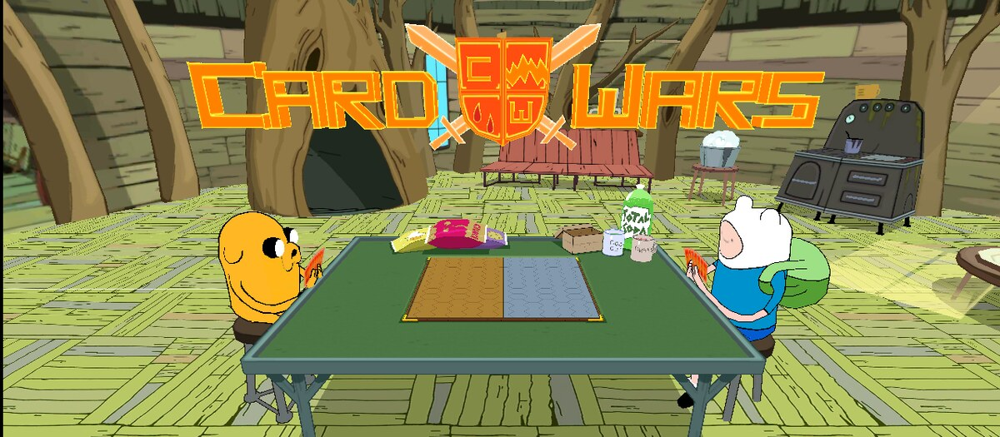
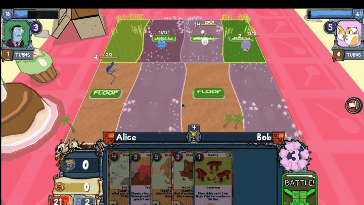
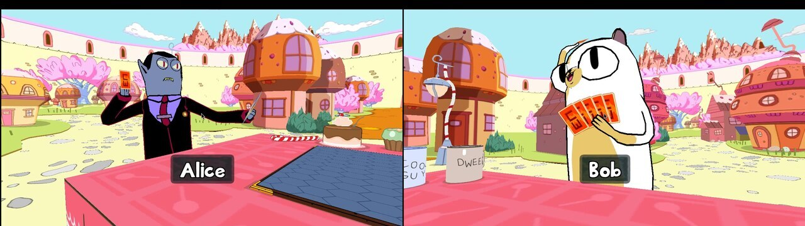
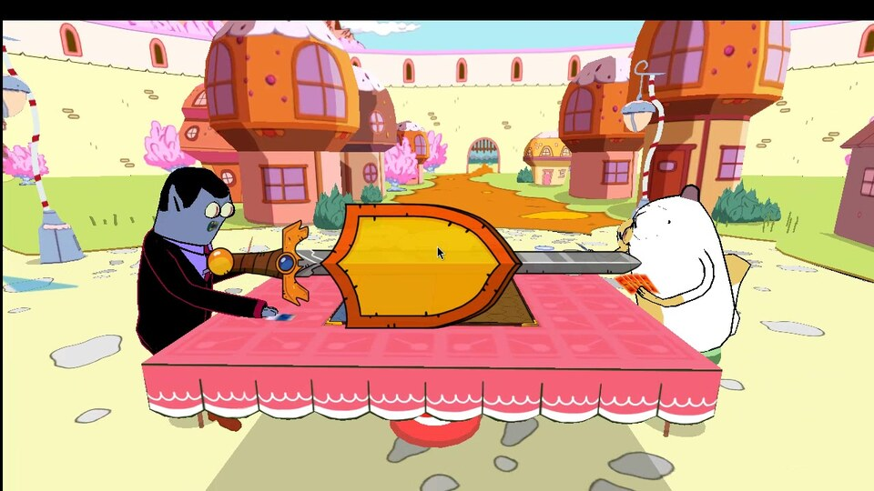
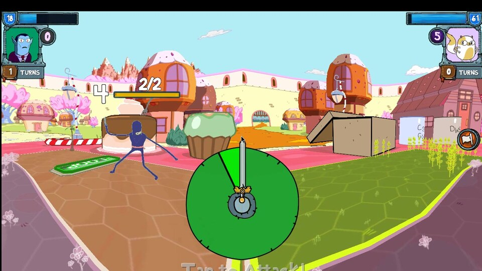
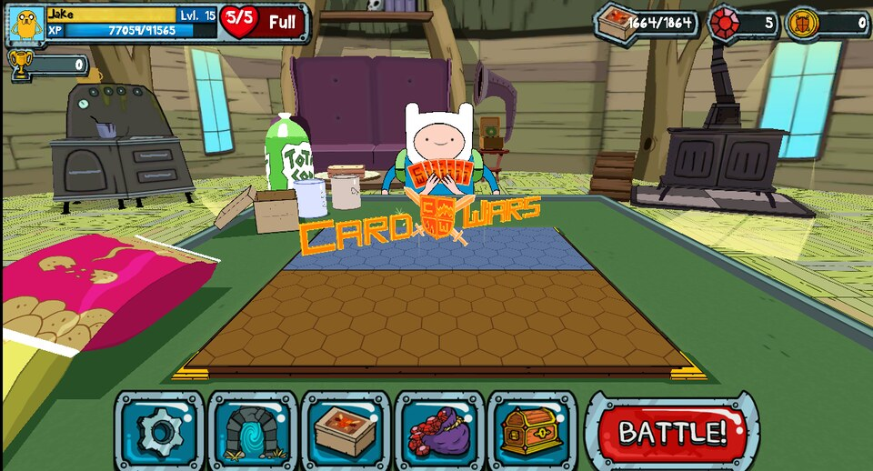
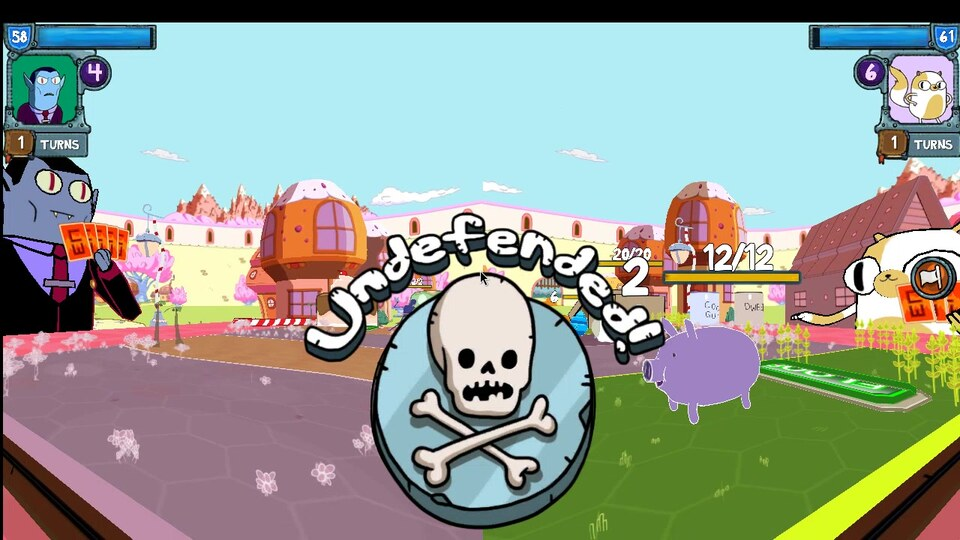
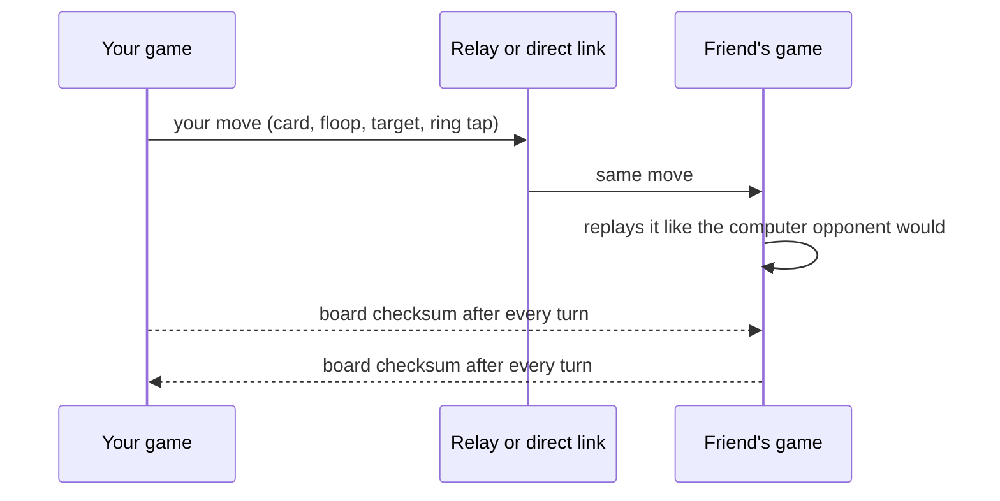

<p align="center"></p>

<h1 align="center">Card Wars 1v1</h1>

<p align="center">
  <b>Adventure Time: Card Wars on PC, with live 1v1 against a friend over the internet.</b><br>
  The real game: the same 3D board, creatures, floops, ketchup bottle and battle ring, with your friend in the opponent's chair.
</p>

<p align="center">
  <a href="https://github.com/k1ri2o/CardWars/releases/tag/1v1-latest"></a>
  <a href="web/README.md"></a>
</p>

<p align="center">
  <a href="https://github.com/k1ri2o/CardWars/actions/workflows/versus.yml"></a>
  <a href="https://github.com/k1ri2o/CardWars/actions/workflows/web.yml"></a>
  
  
</p>

<p align="center">
  
</p>

## Why it's cool

- **Real 1v1 in the original game.** Host a match, read out the 5-letter room code, and your friend joins from anywhere. Each of you plays your own deck, on your own turn, and taps the ring for your own creatures.
- **Works over the internet or on the same Wi-Fi.** Matches go through free public relays, so nobody has to open ports. On the same network you can also connect directly.
- **Everything unlocked from the first launch.** No tutorial. Every card (4 copies of each, the most a deck can hold), every hero, every quest on both maps and every dungeon.
- **Both games stay in sync.** Every move is replayed on the other side through the same code the computer opponent uses, all randomness comes from a shared seed, and the two games compare a checksum of the board after every turn.
- **Also in the browser.** A web version of the battle for two players, playable on phones too, with pass & play and a practice mode.

## Screenshots

<table>
  <tr>
    <td colspan="2"></td>
  </tr>
  <tr>
    <td colspan="2" align="center">Two real players: you and your friend take the seats</td>
  </tr>
  <tr>
    <td></td>
    <td></td>
  </tr>
  <tr>
    <td align="center">Battle!</td>
    <td align="center">Tap the ring for your own creatures</td>
  </tr>
  <tr>
    <td></td>
    <td></td>
  </tr>
  <tr>
    <td align="center">Everything unlocked: 1664 cards, level 15 heroes</td>
    <td align="center">Leave a lane open and pay for it</td>
  </tr>
</table>

## Install (Windows)

Download and double-click **Install-CardWars1v1.bat** from the
[1v1-latest release](https://github.com/k1ri2o/CardWars/releases/tag/1v1-latest), or paste
this into PowerShell:

```powershell
irm https://github.com/k1ri2o/CardWars/releases/download/1v1-latest/Install-CardWars1v1.ps1 -OutFile $env:TEMP\i.ps1; powershell -ExecutionPolicy Bypass -File $env:TEMP\i.ps1
```

It downloads Card Wars 1.12.8 for Windows, swaps in the 1v1 build of the game's code and
puts a **Card Wars 1v1** shortcut on your desktop. Run it again to update. Both players need
the same version.

The first launch may show an optional *Register / Login* box: press **Cancel**, then **No**,
to play as a guest.

## Play a friend

1. Pick your deck in the deck builder.
2. Tap **Battle**, then **Deck Wars**. The *Play a Friend* screen opens.
3. One player taps **Host a match** and reads out the room code.
4. The other types the code and taps **Join**.

After the match, **Rematch** starts another one. The full rules and details are in
[versus/README.md](versus/README.md).

## How it works



The game's own C# scripts are in `Assets/Scripts/Assembly-CSharp/`. The 1v1 code lives in
[`Versus/`](Assets/Scripts/Assembly-CSharp/Versus): the lobby and session, a reliable
message channel, the MQTT relay and direct TCP links, the shared random seed, and robot
players that play whole matches by themselves for testing. GitHub Actions compiles the
scripts into `Assembly-CSharp.dll` with Mono on every push and publishes the installer.

## What's in this repository

| Folder | What it is |
| --- | --- |
| [`Assets/`](Assets) | The Unity 2017.4 project of the PC port: scripts, card and hero data, art, scenes |
| [`Assets/Scripts/Assembly-CSharp/Versus/`](Assets/Scripts/Assembly-CSharp/Versus) | Live 1v1 and the everything-unlocked starter pack |
| [`versus/`](versus) | Windows installer, DLL build script, relay check |
| [`web/`](web) | The browser version of the battle |

## Build it yourself

You don't need Unity to build the game code:

```bash
versus/build-dll.sh <CardWars_Data/Managed folder of the 1.12.8 release> Assembly-CSharp.dll
```

Copy the DLL into `CardWars/game/CardWars_Data/Managed/`. The full Unity project opens in
Unity 2017.4.40f1.

## Credits

Card Wars and Adventure Time belong to Cartoon Network. The original mobile game was made
by Kung Fu Factory. The PC port this builds on is
[shishkabob27/CardWars](https://github.com/shishkabob27/CardWars). This is a non-commercial
fan project and is not affiliated with or endorsed by any of them.
